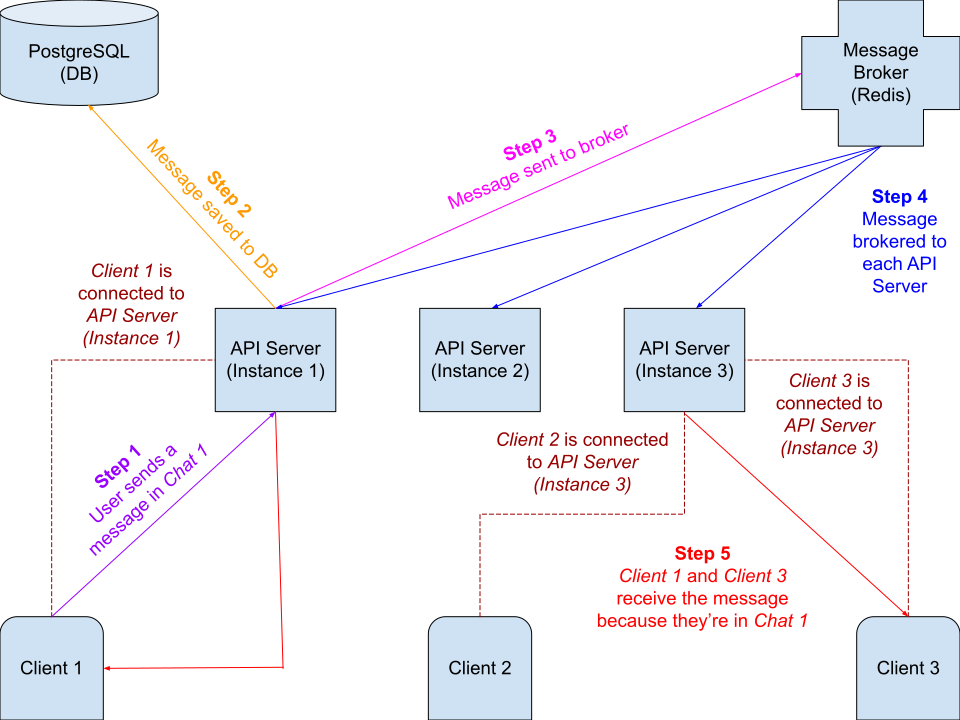

# Developing

## Server

### Testing

1. Spin up the services:
    ```
    docker-compose \
        -f docker/docker-compose.yml \
        -f docker/docker-compose.override.yml \
        --project-directory . \
        up --scale chat=0 -d
    ```
1. Enter the shell:
    ```
    docker-compose \
        -f docker/docker-compose.yml \
        -f docker/docker-compose.override.yml \
        --project-directory . \
        run --rm --service-ports chat sh -c 'flyway migrate && bash'
    ```
1. Reports save to `build/reports/tests/test/`. Update the code and run tests any number of times:
    1. `gradle test`
    1. Optionally, debug:
        1. Wait for `Listening for transport dt_socket at address: 5005` to be printed.
        1. Run `jdb -attach 5005` in another terminal.
        1. Run `exit` in the debugger's terminal once you're done.
1. Run `exit` to shut down the shell.
1. To shut down the services:
    ```
    docker-compose \
        -f docker/docker-compose.yml \
        -f docker/docker-compose.override.yml \
        --project-directory . \
        down
    ```

### Development

1. Run the server on http://localhost with autoreload enabled:
    ```
    docker-compose \
        -f docker/docker-compose.yml \
        -f docker/docker-compose.override.yml \
        --project-directory . \
        up --build -d
    ```
1. To shut down:
    ```
    docker-compose \
        -f docker/docker-compose.yml \
        -f docker/docker-compose.override.yml \
        --project-directory . \
        down
    ```

### Production

To test the production build:

1. Start the server on http://localhost:
    ```
    docker-compose \
        -f docker/docker-compose.yml \
        -f docker/docker-compose.prod.yml \
        --project-directory . \
        up --build -d
    ```
1. To shut down:
    ```
    docker-compose \
        -f docker/docker-compose.yml \
        -f docker/docker-compose.prod.yml \
        --project-directory . \
        down
    ```

## OpenAPI Spec

[`openapi.yaml`](openapi.yaml) is the REST API spec.

### Development

```
npx redoc-cli serve docs/openapi.yaml -w
```

Open http://127.0.0.1:8080 in your browser. The documentation will automatically rebuild whenever you save a change to the spec. Refresh the page whenever you want to view the updated documentation.

### Testing

```
npx @stoplight/spectral lint docs/openapi.yaml
```

## GraphQL

- Since it's understood that the [mutations](../src/main/kotlin/graphql/operations/Mutations.kt), [models](../src/main/kotlin/graphql/routing/Models.kt), etc. are for the [schema](../src/main/resources/schema.graphqls), don't duplicate the schema doc comments in the Kotlin files.
- An operation which is a subscription must be named using the format `subscribeTo<UPDATE>` (e.g., `subscribeToMessages`).
- An operation which is a subscription must return a `union` named using the format `<UPDATE>Subscription`, and includes the type `CreatedSubscription` (e.g., `union MessagesSubscription = CreatedSubscription | NewMessage`).
- An `input` for updating a resource must have its name suffixed with `Update` (e.g., `AccountUpdate`).
- A `type` representing an updated resource, such as one returned via a subscription, must have its name prefixed with `Updated` (e.g., `UpdatedAccount`).
- A `union` returned by a `Query` or `Mutation` must be the operation's name suffixed with `Result` (e.g., the `union` returned by `Query.searchChatMessages` is named `SearchChatMessagesResult`).

Here's how to create Kotlin [models](../src/main/kotlin/graphql/routing/Models.kt) for GraphQL types:

|GraphQL|Kotlin|
|---|---|
|`type`|A `data class` or `object`.|
|`input`|`data class`|
|`interface`|`interface`|
|`union`|Create an `interface` sans body, and have the `union`'s types inherit from it.|
|`enum`|`enum class`|
|`scalar`|A `data class`, `typealias`, predefined class (e.g., `String`, `LocalDateTime`), or `object`.|

## Naming Conventions

We use `create` (e.g., `createAccount`), `read` (e.g., `readAccount`), `update` (e.g., `updateAccount`), `delete` (e.g., `deleteAccount`), `is` (e.g., `isUsernameTaken`), and `search` (e.g., `searchAccounts`) to name functions. Don't use `get`, `set`, etc. unless needed.

## Writing Tests

- Pics must be actual images (e.g., [`76px×57px.jpg`](../src/test/resources/76px×57px.jpg)) because a thumbnail is generated upon upload, and the program will crash if dummy data is provided. Other file formats such as audio should use dummies such as `kotlin.ByteArray`s.
- These test cases must be implemented when testing [forward](ForwardPaginationTest.kt) and [backward](BackwardPaginationTest.kt) pagination.
- Inline fragments in [`Fragments.kt`](../src/test/kotlin/graphql/operations/Fragments.kt) use the format `<FRAGMENT>_<FIELD>_<ARGUMENT>` when naming variables. For example, an argument `last` to a field `messages` in a fragment `ChatMessages` would be named `chatMessages_messages_last`.
- The test source set should mirror the main source set. Files containing tests should be named using the format `<FILE>Test.kt` (e.g., `AppTest.kt` for `App.kt`). Files containing extra functionality should be named using the format `<FILE>Util.kt` (e.g., [`GroupChatsUtil.kt`](../src/test/kotlin/db/tables/GroupChatsUtil.kt) for [`GroupChats.kt`](../src/main/kotlin/db/tables/GroupChats.kt)).
- Test cases should be placed in classes named after the class getting tested (e.g., `class PicTest` for `class Pic`). Keep tests for top-level functions in a class named after the file (e.g., the top-level `fun myFun()` in `MyFile.kt` would have its tests placed in `class MyFileTest`).
- Each function tested should have its test cases placed in a `@Nested inner class`. The name of this class must have its first letter capitalized, and `.`s replaced with `_`s. For example, `MyFun` for `fun myFun()`, `Expression_iLike` for `fun Expression<String>.iLike(pattern: String)`, `Init` for an `init`, `Person_Companion_build` for `fun build()` in a `companion object` where the `companion object` is inside a `class Person`, `MyNestedClass_myFun` for `fun myFun()` in `class MyNestedClass`). Test cases should be placed in the `@Nested inner class` of the function getting tested (i.e., if you're testing a private function through its public interface, or testing a function via a convenience function, place the test cases in the class of the function actually getting tested).

## Diagram

Here's a diagram of how the service works. The client application isn't included in this repo but is included in the diagram for the purpose of explanation. PostgreSQL and Redis may be set up as clusters similar to the API server.



## Releasing

1. Update the version in the [build file](../build.gradle.kts), [OpenAPI spec](openapi.yaml), and the `chat` service's image in [`docker-compose.yml`](docker-compose.yml).
1. Ensure the [API docs **Operations** section](api.md#operations), [`Types.kt`](../src/main/kotlin/graphql/engine/Types.kt), [`AppUtil.kt`](../src/test/kotlin/AppUtil.kt), and [`Fragments.kt`](../src/test/kotlin/graphql/operations/Fragments.kt) are up-to-date.
1. Add a [changelog](CHANGELOG.md) entry.
1. Update the steps to migrate to the new version in [`docker-compose.md`](docker-compose.md).
1. Update [`cloud.md`](cloud.md).
1. Commit to the `master` branch to either release a new version or overwriting the previous one.
